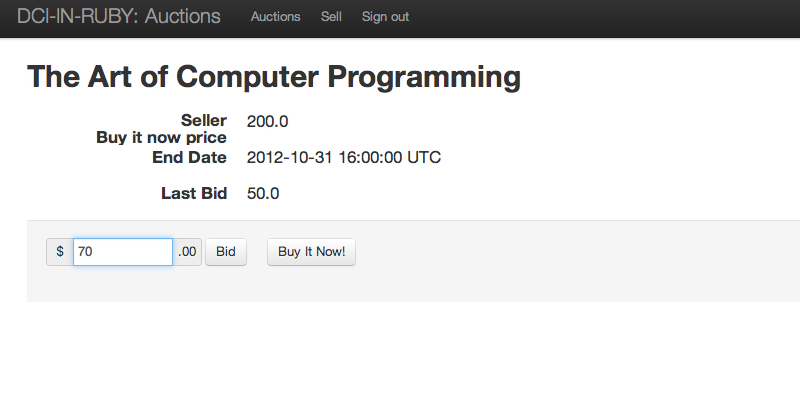



The application implements the following use cases:

* Creating a new auction
* Bidding
* Closing expired auctions

## Creating a new auction

A signed in user can create a new auction by filling in all the required fields.

All users can view the list of auctions.

## Bidding

Another user can bid on an auction.

After clicking "Bid" the confirmation message pops up.

Another bid.

Another bid is accepted.

The seller can see all the bids on the item.

Bidding includes a lot of validations.

A user can purchase an item by buying Buy It Now price.

