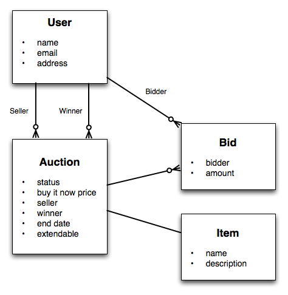
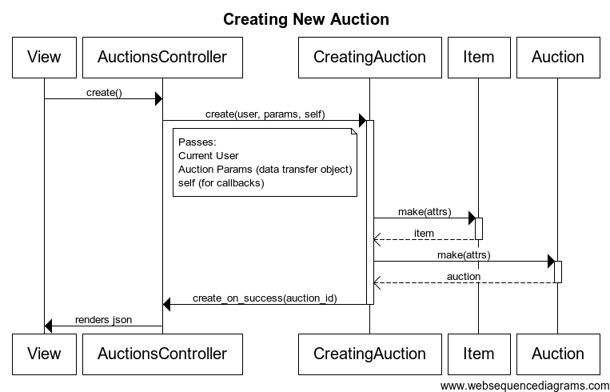
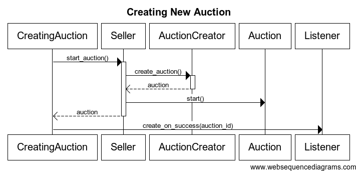
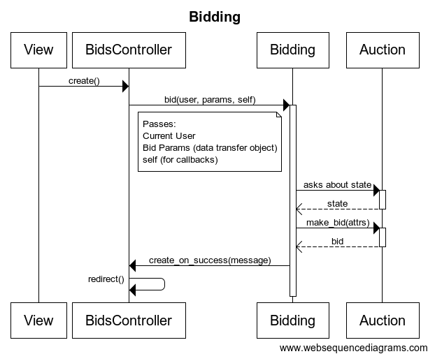
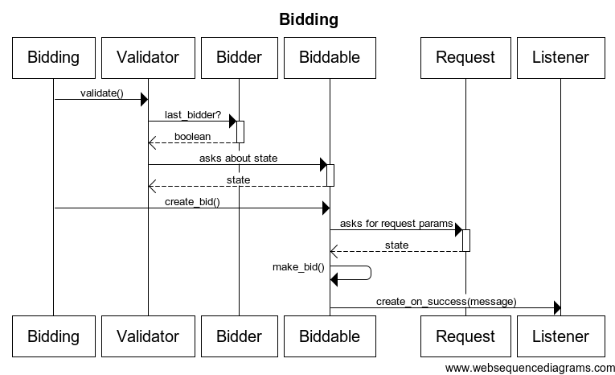



This is a high level technical overview of the project. I'm going to talk about entities, use cases, persistence strategies, presenters, etc. I believe after reading this overview you will feel pretty comfortable with the source code.

<h2 class="block">Data</h2>

The domain of the project comprises the following four entities: Auction, Bid, Item, and User. The relationships between them are shown on this diagram:

The Auction and Bid classes form an aggregate, with Auction as the root. Thus, all bids can be created and accessed only through their auctions. Item and User are two other aggregates. 

The entities contain only local behaviour. That is to say, there are no interactions between aggregates. An example of a method than an entity can have is the following:

	  def assign_winner bidder
	    self.winner = bidder
	    close
	  rescue ActiveRecord::RecordInvalid => e
	    raise InvalidRecordException.new(e.record.errors.full_messages)
	  end

<h2 class="block">Use Cases</h2>

The application implements the following use cases:

* Creating a new auction
* Bidding
* Closing expired auctions

In addition to this, the application displays the list of all auctions, and detailed information about an individual auction. Let's take a look at two use cases.

<h3 class="block">Creating New Auction</h3>

Creating a new auction is a fairly simple use case. First, AuctionsController sends a message to the CreatingAuction context passing the current user, the user's input, and itself. After that, the context creates a new item, and a new auction based on the passed data. It then notifies the controller, which renders a success response to the view. The following diagram shows the interaction between all the layers of the system:

### Context

Another diagram showing how a seller, auction creator, and listener interact with each other to execute this use case inside the context:

### Notes

* We're wrapping the user's input into a data transfer object (AuctionParams), that is playing the role of an auction creator inside the context.

* The use case isn't aware of the controller. The use case expects to be given an object (Listener) that it can notify about a success or failure. The controller is just playing the role of a listener.

<h3 class="block">Bidding</h3>

Bidding is a far more complicated use case. BidsController sends a message to the Bidding context passing the current user, the user's input, and itself. First, the context runs validations making sure that the user's input is valid, and the user isn't bidding against himself. After that, it creates a new bid. Lastly, it notifiies the controller, which renders a success response. The following diagram shows the interaction between all the layers of the system:

### Interaction

There are some pretty complicated interactions between a validator, bidder, biddable, request, and listener inside the context. The following diagram shows how the use case gets executed:

### Notes

* The use case isn't aware of the controller. The use case expects to be given an object (Listener) that it can notify about a success or failure. The controller is just playing the role of a listener.

* The Validator and Biddable roles are two control centers in this use case.

<h2 class="block">Persistence</h2>

We didn't set out to decouple persistence from the domain logic. There are many ways to do it, but almost nobody does it in the Rails community. So we didn't want to confuse the reader by mixing such techniques with DCI. But even so, we decoupled the contexts from ActiveRecord. Which allows us, if I have such a need, to swap a persistence framework or even completely decouple persistence without changing the contexts. To do it we had to wrap up all AR methods and exceptions.

	  def self.make attrs
	    create! attrs.merge(status: PENDING)
	  rescue ActiveRecord::RecordInvalid => e
	    raise InvalidRecordException.new(e.record.errors.full_messages)
	  end

<h2 class="block">Presenters</h2>

Being big fans of logicless templates, we wrap up all the domain objects in presenters. 

	  def show
	    auction_to_show = Auction.find(params[:id])
	    @auction = AuctionPresenter.new(auction_to_show, current_user, view_context)
	  end

<h2 class="block">Rails-Domain Separation</h2>

As I've already mentioned, we decided not to completely decouple persistence from the domain logic to make the application easier to understand. However, we went a little bit further with separating controllers and contexts. 

### A context shouldn't anything about Controllers, Views, and Rails in general.

One way to achieve this decoupling is to build a response inside a context that a controller can deconstruct.

	  def create
	    result = CreatingAuction.create current_user, AuctionParams.new(auction_params)
	    if result[:status] == :success
	      flash[:notice] = "Auction was successfully created."
	      render :json => {auction_path: auction_path(result[:auction].id)}
	    else
	      render :json => {:errors => result[:errors]}, :status  => :unprocessable_entity
	    end
	  end

Here CreatingAuction returns a hash containing a status, a list of errors, and an auction. The controller checks the status. It then uses the auction or the list of errors to render its response. Though this approach works alright for simple situations, it introduces some duplication when it's used for more complex use cases, since the context, the context's test, and the controller have to understand the format of that hash. 

For this reason, we prefer a different approach. Instead of parsing the response, the controller acts as the listener that the context notifies about a success or failure.

	  def create
	    CreatingAuction.create(current_user, auction_params, self)
	  end

	  def create_on_success auction_id
	    flash[:notice] = "Auction was successfully created."
	    render json: {auction_path: auction_path(auction_id)}
	  end

	  def create_on_error errors
	    render json: {:errors => errors}, status: :unprocessable_entity
	  end